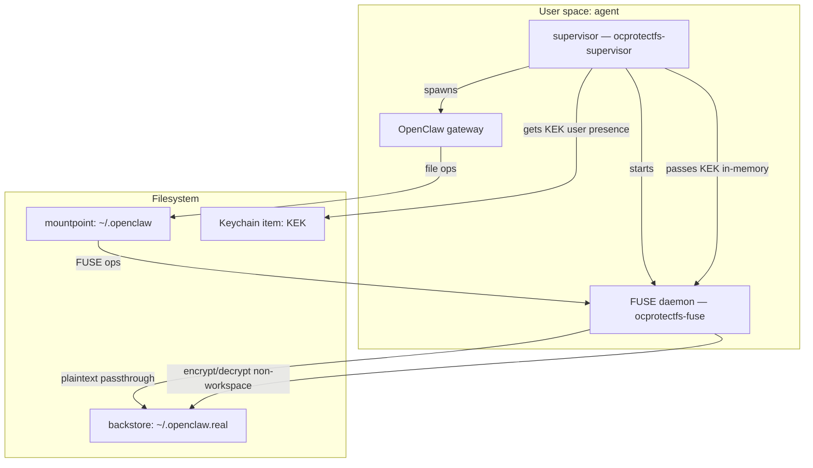
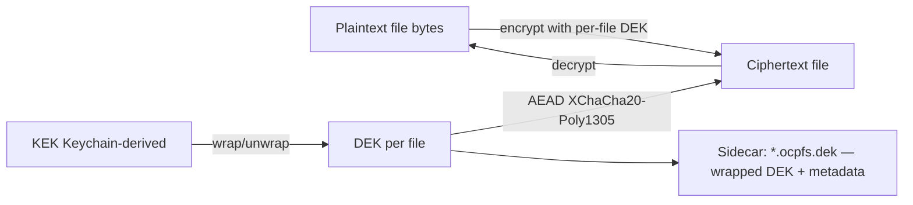

# openclaw-protectfs

[](https://github.com/Martin-Tech-Labs/openclaw-protectfs/actions/workflows/ci.yml)
[](LICENSE)


macFUSE-based protective filesystem overlay for OpenClaw on macOS.

## TL;DR (end-to-end)

### Operator quick start (mount + run gateway)

Goal: mount a protective overlay at `~/.openclaw`, migrate your existing data to `~/.openclaw.real` on first run, and start the OpenClaw gateway via the supervisor.

1) Install and enable **macFUSE** (required on macOS).

2) Clone + install:

```bash
gh repo clone Martin-Tech-Labs/openclaw-protectfs
cd openclaw-protectfs
npm install
```

3) Start the supervisor.

The supervisor **supervises two long-running processes**:
- the FUSE daemon (this repo): `fusefs/ocprotectfs-fuse.js`
- your OpenClaw gateway process (must stay running; wrapper will shut down the mount if it exits)

If you just want to validate the mount + encryption behavior **without** starting OpenClaw yet, you can use a dummy gateway (`/bin/sleep`) for a smoke test:

```bash
node wrapper/ocprotectfs.js \
  --require-fuse-ready \
  --fuse-bin node \
  --fuse-arg fusefs/ocprotectfs-fuse.js \
  --gateway-bin /bin/sleep \
  --gateway-arg 1000000
```

Notes:
- The KEK (Key Encryption Key) is retrieved/created in macOS Keychain (`service=ocprotectfs`, `account=kek`).
- The wrapper passes the KEK to the FUSE daemon **in-memory via an anonymous pipe** (no env secret).
- For a real deployment, replace the dummy gateway with the command that runs your OpenClaw gateway in the foreground.

Optional (advanced): **reset the KEK in Keychain**.

By default, the supervisor will **create and manage** the KEK Keychain item automatically on first run.
On macOS, it uses native Keychain APIs (via a small Swift helper) and configures the item to require **interactive user presence** (Touch ID / password) when accessed.

If you need to rotate/reset the KEK (this will make existing encrypted data unreadable unless you also rotate/re-encrypt DEKs), you can delete the item:

```bash
# Danger: rotating the KEK breaks decryption of previously-encrypted data.
security delete-generic-password -s ocprotectfs -a kek
```

4) Quick verify (plaintext vs ciphertext):

```bash
# Workspace is passthrough plaintext
echo "hello" > ~/.openclaw/workspace/_ocpfs_smoketest.txt

# Non-workspace paths are encrypted-at-rest in ~/.openclaw.real
echo "secret" > ~/.openclaw/_ocpfs_smoketest_secret.txt

# The mounted view shows plaintext...
cat ~/.openclaw/_ocpfs_smoketest_secret.txt

# ...but the backstore should not.
# (If this finds the word 'secret' under ~/.openclaw.real, something is wrong.)
grep -R "secret" ~/.openclaw.real || echo "OK: not found in backstore"
```

5) Rollback (if anything looks wrong): stop the supervisor (Ctrl-C) and see **Safety / rollback** below.

### Developer quick start (tests)

```bash
npm install
npm test
# real macFUSE mount tests run automatically on macOS when prerequisites exist.
# On very new Node majors, they are skipped unless explicitly forced.
# In CI they are skipped unless explicitly enabled:
# CI=1 OCPROTECTFS_RUN_REAL_MOUNT_TESTS=1 npm test
```

## Status
- **Initial: COMPLETE** (see `tasks/STATUS.md` for the canonical tracker)
- Recommendation: disable the protectfs repo heartbeat cron unless you want post-initial verification/backlog work.
- Last updated: 2026-03-25 (final bookkeeping)

**Final bookkeeping:** Initial is complete; this repo loop can be disabled.

## What problem this solves
OpenClaw stores sensitive data under `~/.openclaw` (sessions, profiles, internal state). Tools and other same-user processes can often read those files.

This project provides a **path-compatible** mount over `~/.openclaw` that:
- keeps workspace data usable and plaintext
- stores everything else **encrypted at rest**
- enforces a **fail-closed** access policy for sensitive paths

## Components
- **Supervisor (`ocprotectfs-supervisor`)**
  - obtains the Key Encryption Key (KEK) from macOS Keychain (user presence)
  - mounts the FUSE filesystem at `~/.openclaw`
  - starts OpenClaw gateway as a child process
  - maintains a liveness socket so the FUSE layer can fail-closed if wrapper/gateway die

- **FUSE daemon (`ocprotectfs-fuse`)**
  - implements filesystem operations (getattr/readdir/open/read/write/rename/unlink/…)
  - classifies paths (workspace passthrough vs encrypted)
  - encrypts/decrypts non-workspace file contents
  - hides sidecar metadata files from the mounted view

- **Backstore (`~/.openclaw.real`)**
  - real on-disk storage
  - workspace subtree is stored as plaintext
  - sensitive subtree is stored as ciphertext + sidecars

- **OpenClaw gateway**
  - performs normal OpenClaw operations and reads/writes via the mounted `~/.openclaw`

## What are FUSE and macFUSE?
- **FUSE** (Filesystem in Userspace) lets you implement a filesystem in a normal user-space process.
- **macFUSE** is the macOS kernel extension + tooling that enables FUSE filesystems on macOS.

In this project, macFUSE routes file operations on `~/.openclaw` into our FUSE daemon, which then enforces policy and reads/writes the backstore.

## Policy
- Plaintext passthrough (configurable): selected *top-level prefixes* under the mount.
  - Default passthrough prefixes:
    - `~/.openclaw/workspace/**`
  - Configure passthrough prefixes (examples):
    - FUSE flags (repeatable): `ocprotectfs-fuse --plaintext-prefix workspace --plaintext-prefix workspace-joao`
    - Or env var (comma-separated): `OCPROTECTFS_PLAINTEXT_PREFIXES=workspace,workspace-joao`

- Encrypted-at-rest (everything else under `~/.openclaw/**`)
  - stored encrypted in `~/.openclaw.real`
  - each encrypted file has a wrapped per-file DEK sidecar `*.ocpfs.dek` (hidden from mount)

- Fail-closed rules for encrypted paths
  - deny access unless wrapper/gateway checks pass (initial currently includes bring-up gating; see Security notes)

## Architecture diagram


## Crypto diagram


## Installation (developer)
### Prerequisites
- macOS
- macFUSE installed and enabled
- Node.js (use the same node runtime you use for OpenClaw)

### Clone + install
```bash
gh repo clone Martin-Tech-Labs/openclaw-protectfs
cd openclaw-protectfs
npm install
npm test
```

**Real macFUSE mount** tests run automatically on macOS when prerequisites exist.

In CI they are skipped unless explicitly enabled:

```bash
CI=1 OCPROTECTFS_RUN_REAL_MOUNT_TESTS=1 npm test
```

(See `docs/local-macfuse.md` for prerequisites/troubleshooting.)

## Running (operator)
### Backstore (`~/.openclaw.real`) — what it is
ProtectFS mounts a **path-compatible view** at `~/.openclaw`, but the **real bytes on disk** live in the backstore:

- `~/.openclaw` — the **mounted view** (what OpenClaw and tools read/write)
- `~/.openclaw.real` — the **backstore** (the underlying storage)

Think of `~/.openclaw.real` as “the real data directory”, and `~/.openclaw` as a policy-enforced overlay on top.

Notes:
- Workspace passthrough prefixes are stored plaintext in the backstore (so developer tooling stays usable).
- Everything else is stored encrypted-at-rest in the backstore (ciphertext + `*.ocpfs.dek` sidecars).

### First run / migration (don’t lose your pre-existing `~/.openclaw`)
When ProtectFS first mounts at `~/.openclaw`, any **pre-existing** content that was already in `~/.openclaw` would otherwise become **hidden under the mount**.

To avoid that, the wrapper performs a one-time migration step **before mounting**:

- Moves existing entries out of `~/.openclaw` into:
  - `~/.openclaw.real/.legacy-openclaw/<timestamp>/...`
- Writes a marker file:
  - `~/.openclaw.real/.ocpfs.migrated.json`
- Uses an in-progress file for fail-closed behavior (if present, startup stops and you inspect manually):
  - `~/.openclaw.real/.ocpfs.migrating.json`

If you ever need to inspect what got moved, look in the `.legacy-openclaw/` directory in the backstore.

### Start supervisor
Run the supervisor (wrapper entrypoint) which mounts FUSE and starts the gateway.

(Exact command names/flags are in-repo; this README is the single operator entrypoint.)

## Secrets / key storage
- **KEK** (Key Encryption Key): stored in macOS Keychain as a **generic password** item
  - service: `ocprotectfs`
  - account: `kek`
  - value: **base64-encoded 32-byte random key** (so arbitrary bytes round-trip)
  - created automatically by the wrapper if missing (or you can pre-provision it; see TL;DR above)
- **DEKs**: per-file, wrapped by KEK and stored in `*.ocpfs.dek` sidecars in the backstore
- **Ciphertext**: stored in `~/.openclaw.real` for all non-workspace paths

## Security notes
Some bring-up flows use explicit env gates for testing (e.g. allowing gateway access checks). Those are not intended as the final trust boundary; the intended boundary is wrapper/gateway liveness + identity checks enforced at the FUSE layer.

OWASP-oriented hardening notes (PLAN 23):
- All FUSE ops must enforce access checks consistently (no “authz then still do the syscall” footguns).
- Fail-closed by default for encrypted paths.

Known limitations / non-goals:
- The encrypted file implementation currently buffers whole-file plaintext in memory for some operations (large-file DoS potential).
- Metadata is not fully hidden (e.g. directory structure + filenames exist in the backstore).
- Logging favors operator debuggability and may include absolute paths.

## Repo workflow
- Work is tracked under `tasks/`.
- Toby authors PRs; Joao reviews (max 2 rounds).

## CI notes (macOS + macFUSE)
- The default CI workflow runs on **ubuntu-latest** and **macos-latest**.
- On GitHub-hosted macOS runners, you generally **cannot** install/enable the macFUSE kernel extension reliably.
  - So CI runs **unit-style tests only** (real-mount acceptance tests remain opt-in).
- To run real-mount acceptance tests in CI, use a **self-hosted macOS runner** with macFUSE installed:
  - workflow: `.github/workflows/macos-real-mount.yml` (manual `workflow_dispatch`)

## Repo layout (code + tests)
- `wrapper/src/**` — wrapper implementation
- `wrapper/test/**` — unit-style tests for wrapper
- `wrapper/acceptance/**` — opt-in real-mount acceptance tests (macOS + macFUSE)

- `fusefs/src/**` — FUSE implementation
- `fusefs/test/**` — unit/wiring tests for the FUSE layer
- `fusefs/acceptance/**` — best-effort real-mount acceptance tests (macOS + macFUSE)

### Running tests
```bash
npm test
# or:
make test
```

Coverage (Node test runner):

```bash
npm run coverage
npm run coverage:check
```

**Real macFUSE mount** acceptance tests run automatically on macOS when prerequisites exist.

In CI they are skipped unless explicitly enabled:

```bash
CI=1 OCPROTECTFS_RUN_REAL_MOUNT_TESTS=1 npm test
```

## Running

### Environment variables
Wrapper-provided:
- `OCPROTECTFS_LIVENESS_SOCK`: unix socket path created by the wrapper and passed to child processes. Encrypted-path operations fail closed unless this socket is present.

KEK handling (recommended):
- Default (v1): wrapper retrieves/creates KEK from macOS Keychain (`service=ocprotectfs`, `account=kek`).
- Opt-in (v2): set `OCPROTECTFS_KEK_V2=1` to store a *wrapped* KEK in Keychain (`service=ocprotectfs`, `account=kek.v2.wrapped`) and unwrap it via a Keychain-held **non-exportable** RSA private key (tag: `ocprotectfs.kekwrap.v2`).
  - This avoids persisting the raw KEK as an exportable Keychain secret.
  - Migration/rollback: v2 does not read the v1 `kek` item; to reset, delete the `kek.v2.wrapped` item (and the `ocprotectfs.kekwrap.v2` keypair if desired).
- Wrapper passes KEK to the FUSE daemon in-memory via an anonymous pipe FD (`--kek-fd`).

Legacy/testing-only:
- `OCPROTECTFS_KEK_B64`: base64-encoded 32-byte KEK (do not use for production runs)

### Start supervisor (spawns FUSE + gateway)

Wrapper entrypoint:

```bash
node wrapper/ocprotectfs.js --help
```

Smoke-test invocation (mount + encrypt/decrypt behavior, with a dummy gateway that just keeps the wrapper alive):

```bash
node wrapper/ocprotectfs.js \
  --require-fuse-ready \
  --fuse-bin "$(command -v node)" \
  --fuse-arg "$(pwd)/fusefs/ocprotectfs-fuse.js" \
  --gateway-bin /bin/sleep \
  --gateway-arg 1000000
```

Real deployment:
- Use the same `--fuse-*` flags as above.
- Replace `--gateway-bin/--gateway-arg` with the command that runs your OpenClaw gateway **in the foreground** (the wrapper supervises it; if it exits, the wrapper will unmount and fail closed).

## Safety / rollback

To stop and roll back:
1) Stop the wrapper process (SIGINT / SIGTERM).
2) Ensure the mount is unmounted (`umount ~/.openclaw` or the wrapper's best-effort unmount).
3) If you need to restore the original directory layout:
   - move `~/.openclaw` aside
   - move `~/.openclaw.real` back to `~/.openclaw`

## Contributing
- Canonical plan: `tasks/PLAN.md`
- Current status: `tasks/STATUS.md`
